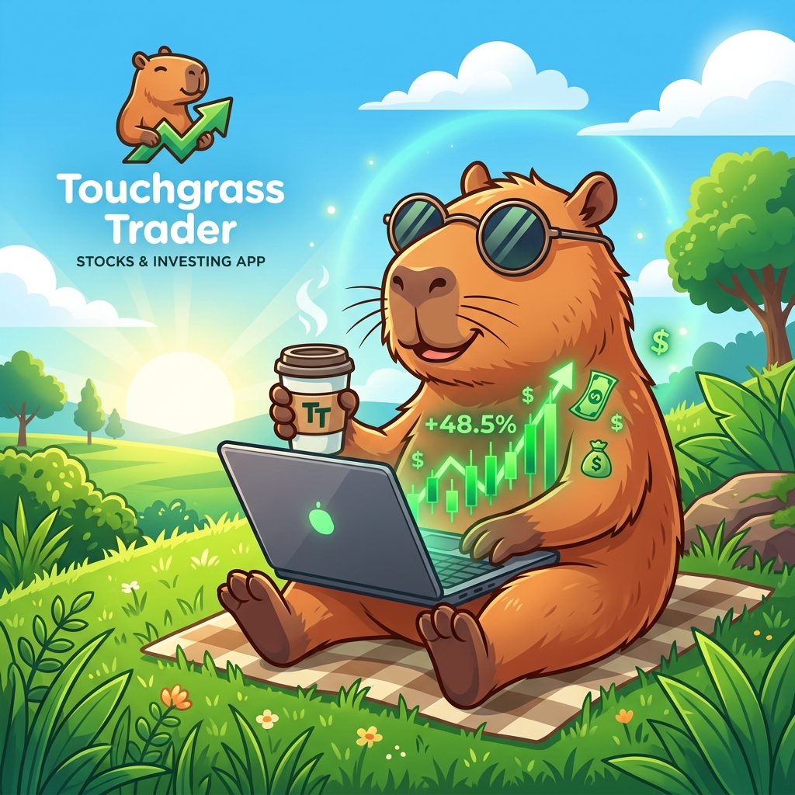
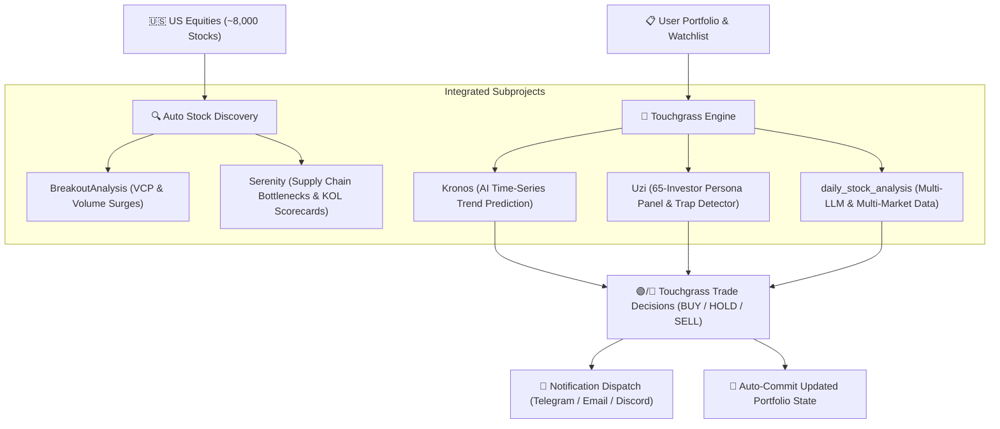

<div align="center">



# 🌿 Touchgrass Trader (`touchgrass`)

**Chill stock management for humans who'd rather touch grass than stare at candle charts all day.**

[](LICENSE)
[](https://www.python.org/downloads/)
[](.github/workflows/touchgrass_market_run.yml)
[](AGENTS.md)
[](#-integrated-subprojects)

---

</div>

## 📖 The Story: Why Touchgrass?

Most retail investors lose money—not because they lack information, but because they spend **too much time** obsessing over 5-minute candle charts, getting tricked by social media hype groups, or panic selling during healthy pullbacks.

**Touchgrass Trader** was built on a simple premise: **Go touch grass while AI manages your stock portfolio with institutional discipline.**

Touchgrass turns complex quantitative tools into a zero-effort, automated market assistant. It runs twice a day—once 2 hours after market open to check early trends, and once 2 hours before market close to execute position adjustments—dispatched directly to your phone via Telegram, Email, or Discord.

---

## ✨ Features

* 🤖 **AI Agent Native (`/touchgrass`)**: Built to integrate natively into **Google Antigravity**, **Claude Desktop**, **Codex**, and **Cursor**. Ask your agent to run analysis, scan for breakouts, or update your portfolio.
* ⏰ **Automated Twice-Daily Market Check**: GitHub Actions workflow runs every trading day (11:30 AM EST & 2:00 PM EST) to evaluate portfolio health and discover high-probability stocks.
* 🔍 **Auto Stock Selection & US Scanner**: Integrates **BreakoutAnalysis** (scanning ~8,000 US equities for VCP contraction & volume surges) and **Serenity** (discovering supply chain bottleneck monopolies like NVDA, TSM, AVGO).
* 🛡️ **Pig-Butchering Scam & Trap Security**: Features **Uzi Trap Detector** to automatically audit stocks against pump-and-dump signals, social media "teacher" traps, and illiquid manipulation.
* 👨‍💼 **65-Investor Persona Panel**: Cross-evaluates every stock through 7 legendary investment factions (Buffett/Munger value, Cathie Wood tech growth, Dalio macro, Minervini momentum, Simons quant).
* 📈 **Kronos AI Time-Series Predictions**: Uses **Kronos** financial deep learning to forecast 5-day directional momentum.
* 📱 **Multi-Channel Notification Digest**: Generates clean, stress-free markdown alerts sent via Telegram, Email, Discord, ServerChan, or Webhooks.

---

## 🚀 Quick Start

### Option 1: GitHub Actions (Recommended ⭐)

> **5 minutes setup, 100% free, zero maintenance, no server required.**

#### 1. Fork this Repository
Click the **Fork** button at the top right of this page to create your personal copy.

#### 2. Configure Repository Secrets
Go to your forked repository: `Settings` ➔ `Secrets and variables` ➔ `Actions` ➔ `New repository secret`.

**AI Model API Keys (Configure at least one)**

| Secret Name | Description | Required |
|-------------|-------------|:--------:|
| `GEMINI_API_KEY` | Google Gemini API Key | **Recommended** |
| `ANTHROPIC_API_KEY` | Anthropic Claude API Key | Optional |
| `OPENAI_API_KEY` | OpenAI API Key (or DeepSeek / Qwen API) | Optional |

**Notification Channels (Configure at least one)**

| Secret Name | Description |
|-------------|-------------|
| `TELEGRAM_BOT_TOKEN` + `TELEGRAM_CHAT_ID` | Telegram Bot Notifications |
| `DISCORD_WEBHOOK_URL` | Discord Webhook Notifications |
| `SERVERCHAN_SENDKEY` | ServerChan Push Notifications |
| `SENDER_EMAIL` + `SENDER_PASSWORD` + `RECEIVER_EMAIL` | Email Notifications |

#### 3. Validate & Run GitHub Actions
1. Go to the **Actions** tab in your repository.
2. Enable workflows by clicking **"I understand my workflows, go ahead and enable them"**.
3. Select **🌿 Touchgrass Market Runner** from the left sidebar.
4. Click **Run workflow** ➔ Select `manual` ➔ Click **Run workflow**.
5. Check the execution logs to verify that market analysis and notification delivery succeed!

---

### Option 2: Local CLI Setup

```bash
# Clone the repository
git clone https://github.com/tianchengc/touchgrass.git
cd touchgrass

# Install dependencies
pip install -r requirements.txt
pip install -e .

# Copy environment template
cp .env.example .env

# Run full market evaluation & portfolio update
python main.py run

# Scan US market for technical breakouts & supply-chain leaders
python main.py scan --max 5

# Perform 360-degree deep analysis on a stock ticker
python main.py analyze NVDA

# View current watchlist and holdings
python main.py watchlist
```

---

## 🤖 Using with AI Agents (Antigravity, Claude, Codex, Cursor)

Touchgrass provides a dedicated **AI Agent Skill** ([`skills/touchgrass/SKILL.md`](skills/touchgrass/SKILL.md) & [`AGENTS.md`](AGENTS.md)).

Simply tell your AI agent:
> *"Touch grass and check my stock portfolio."*  
> *"Scan the market for top breakout stocks and add them to my touchgrass watchlist."*  
> *"Run touchgrass analysis on NVDA and tell me if 65 investor panel approves."*

Your agent will invoke `touchgrass` CLI commands under the hood and summarize the decisions for you.

---

## 🏗️ Architecture & Integrated Subprojects

Touchgrass seamlessly unifies four powerhouse open-source investment engines:



---

## 📊 Sample Notification Digest

```markdown
🌿 **Touchgrass Trader Market Report** (AFTERNOON RUN) 🌿
📅 Date: 2026-08-07 | Status: Market Active
--------------------------------------------------
📊 **Portfolio & Watchlist Health Digest**:
• **NVDA** (NVIDIA Corporation): $223.96 (+2.27%) | Score: 75.0/100 | Action: 🟡 **HOLD**
  └ Kronos: BULLISH (82%) | Panel: HOLD
• **AAPL** (Apple Inc.): $215.50 (+1.10%) | Score: 82.5/100 | Action: 🟢 **BUY**
  └ Kronos: BULLISH (85%) | Panel: BUY

🎯 **Auto-Discovered High-Conviction Candidates**:
• **ARM** (Arm Holdings plc) - Breakout Scanner (VCP/Volume Surge) | Score: 95 | RS Rating: 96, Rel Vol: 3.1x
• **TSM** (Taiwan Semiconductor) - Serenity Supply Chain | Score: 95 | Sole manufacturer of advanced AI chips worldwide.

✨ *Go touch grass! Touchgrass AI is keeping your portfolio safe.* ✨
```

---

## 📜 License

Distributed under the **MIT License**. See [`LICENSE`](LICENSE) for details.

---

<div align="center">

**Made with 💚 for smart, stress-free investors. Star ⭐️ this repo to support open-source AI investing!**

</div>
