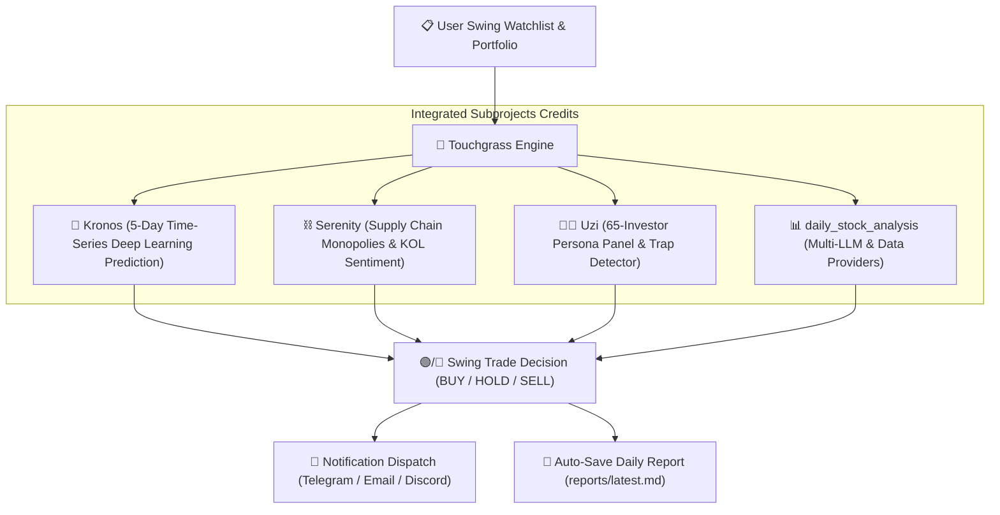

<div align="center">


# 🌿 Touchgrass Trader (`touchgrass`)

**Disciplined Swing Trading decision engine for humans who'd rather touch grass than stare at candle charts all day.**

[](LICENSE)
[-emerald.svg)](#-swing-trading-philosophy)
[](https://www.python.org/downloads/)
[](.github/workflows/touchgrass_market_run.yml)
[](AGENTS.md)
[](#-open-source-credits--integrated-subprojects)

---

</div>

## 📈 Swing Trading Philosophy: Not Intra-Day Noise

**Touchgrass Trader strictly promotes a Swing Trading Strategy (5 to 20 days holding period).**

It is **NOT** a high-frequency day-trading bot. Most retail traders lose capital trying to time 5-minute candle spikes or reacting emotionally to intraday noise.

Instead, Touchgrass:
* **Identifies Multi-Day Swings**: Focuses on high-conviction structural trends, supply-chain monopolies, and institutional accumulation.
* **Runs Twice a Day**:
  - **11:30 AM EST (Morning Check)**: Evaluates early market sentiment & trend confirmation 2 hours after US market open.
  - **2:00 PM EST (Afternoon Check)**: Rebalances positions & executes disciplined entry/exit alerts 2 hours before US market close.
* **Enforces Risk Discipline**: Sets 8% trailing stop-loss bounds and 20% swing take-profit targets to eliminate emotional over-trading.

---

## 🔮 How Kronos AI Time-Series Prediction Model Works in Touchgrass

[**Kronos**](https://github.com/shishi-ai/Kronos) is a foundation deep-learning model trained on financial time-series (OHLCV K-line sequences). Just as LLMs predict the next word in a sentence, Kronos predicts future K-line price trajectories.

### How Kronos is integrated:
1. **Historical Sequence Tokenization**: Touchgrass feeds recent daily price sequences (Open, High, Low, Close, Volume) of watchlist stocks into Kronos.
2. **5-Day Momentum Inference**: Kronos outputs projected 5-to-10 day directional momentum probabilities (`BULLISH`, `NEUTRAL`, `BEARISH`) with confidence metrics.
3. **Multi-Factor Decision Signal**: Touchgrass combines Kronos's time-series prediction with Uzi's 65-Investor Panel and Serenity's Supply Chain Scorecard:
   $$\text{Touchgrass Score} = 0.40 \times \text{Investor Panel} + 0.30 \times \text{Kronos Trend} + 0.30 \times \text{KOL Sentiment}$$

---

## 🙏 Open-Source Credits & Integrated Subprojects

Touchgrass stands on the shoulders of giants. We directly integrate, acknowledge, and actively maintain updated versions of these outstanding open-source projects in `touchgrass/subprojects/`:

| Subproject | Original Author / Repository | Role in Touchgrass Trader |
|------------|------------------------------|----------------------------|
| **`daily_stock_analysis`** | [ZhuLinsen/daily_stock_analysis](https://github.com/ZhuLinsen/daily_stock_analysis) | Multi-LLM provider engine, market data fetchers, report persistence to `reports/`, and multi-channel notifications. |
| **`Kronos`** | [shishi-ai/Kronos](https://github.com/shishi-ai/Kronos) | Deep learning K-line time-series foundation model for 5-day directional swing predictions. |
| **`serenity-skill`** | [tianchengc/serenity-skill](https://github.com/tianchengc/serenity-skill) | Supply chain chokepoint discovery (NVDA, TSM, AVGO, ASML) and KOL conviction scorecards. |
| **`uzi-skill`** | [tianchengc/uzi-skill](https://github.com/tianchengc/uzi-skill) | 65-Investor Persona Panel voting (Buffett, Wood, Dalio, Minervini, Simons) & Pig-Butchering Scam Trap Detector. |

> 📌 **Maintenance Note**: We directly maintain synced, optimized versions of these subprojects inside `touchgrass/subprojects/` to ensure daily report storage (`reports/*.md`), custom bug fixes, and zero-config GitHub Actions deployment.

---

## ⚡ Quick Start

### Option 1: GitHub Actions (Recommended ⭐)

> **5 minutes setup, 100% free, zero maintenance, no server required.**

#### 1. Fork this Repository
Click the **Fork** button at the top right of this page to create your personal copy.

#### 2. Configure Repository Secrets
Go to your forked repository: `Settings` ➔ `Secrets and variables` ➔ `Actions` ➔ `New repository secret`.

**AI Model API Keys (Configure at least one)**

| Secret Name | Description | Required |
|-------------|-------------|:--------:|
| `GEMINI_API_KEY` | Google Gemini API Key | **Recommended** |
| `ANTHROPIC_API_KEY` | Anthropic Claude API Key | Optional |
| `OPENAI_API_KEY` | OpenAI API Key (or DeepSeek / Qwen API) | Optional |

**Notification Channels (Configure at least one)**

| Secret Name | Description |
|-------------|-------------|
| `TELEGRAM_BOT_TOKEN` + `TELEGRAM_CHAT_ID` | Telegram Bot Notifications |
| `DISCORD_WEBHOOK_URL` | Discord Webhook Notifications |
| `SERVERCHAN_SENDKEY` | ServerChan Push Notifications |
| `SENDER_EMAIL` + `SENDER_PASSWORD` + `RECEIVER_EMAIL` | Email Notifications |

#### 3. Validate & Run GitHub Actions
1. Go to the **Actions** tab in your repository.
2. Enable workflows by clicking **"I understand my workflows, go ahead and enable them"**.
3. Select **🌿 Touchgrass Market Runner** from the left sidebar.
4. Click **Run workflow** ➔ Select `manual` ➔ Click **Run workflow**.
5. Check execution logs to verify market analysis and daily report creation in `reports/`!

---

### Option 2: Local CLI Setup

```bash
# Clone the repository
git clone https://github.com/tianchengc/touchgrass.git
cd touchgrass

# Install dependencies
pip install -r requirements.txt
pip install -e .

# Run full market evaluation & portfolio update
python main.py run

# Discover swing trading candidates (Supply chain monopolies & KOL scorecards)
python main.py scan --max 5

# Perform 360-degree swing analysis on a stock ticker
python main.py analyze NVDA

# View current watchlist and holdings
python main.py watchlist
```

---

## 🤖 Using with AI Agents (Antigravity, Claude, Codex, Cursor)

Touchgrass provides a dedicated **AI Agent Skill** ([`skills/touchgrass/SKILL.md`](skills/touchgrass/SKILL.md) & [`AGENTS.md`](AGENTS.md)).

Simply tell your AI agent:
> *"Touch grass and check my swing stock portfolio."*  
> *"Discover top supply-chain monopoly stocks and add them to my swing watchlist."*  
> *"Run touchgrass analysis on NVDA and tell me Kronos trend prediction."*

Your agent will invoke `touchgrass` CLI commands under the hood and summarize the decisions for you.

---

## 🏗️ Architecture Diagram



---

## 📊 Sample Notification Digest

```markdown
🌿 **Touchgrass Trader Market Report** (AFTERNOON RUN) 🌿
📅 Date: 2026-08-07 | Status: Market Active | Strategy: Swing Trade (5-20 Days)
--------------------------------------------------
📊 **Portfolio & Watchlist Health Digest**:
• **NVDA** (NVIDIA Corporation): $223.96 (+2.27%) | Score: 75.0/100 | Action: 🟡 **HOLD**
  └ Kronos 5-Day Trend: BULLISH (82%) | Panel: HOLD
• **AAPL** (Apple Inc.): $313.33 (+0.29%) | Score: 74.7/100 | Action: 🟡 **HOLD**
  └ Kronos 5-Day Trend: BULLISH (82%) | Panel: HOLD

🎯 **Auto-Discovered Swing Candidates**:
• **TSM** (Taiwan Semiconductor) - Serenity Supply Chain | Score: 95 | Sole manufacturer of advanced AI chips worldwide.
• **AVGO** (Broadcom Inc) - Serenity Supply Chain | Score: 88 | Custom AI ASICs & Networking Switches.

✨ *Go touch grass! Touchgrass AI is keeping your portfolio safe.* ✨
```

---

## 📜 License

Distributed under the **MIT License**. See [`LICENSE`](LICENSE) for details.

---

<div align="center">

**Made with 💚 for smart, stress-free investors. Star ⭐️ this repo to support open-source AI investing!**

</div>
